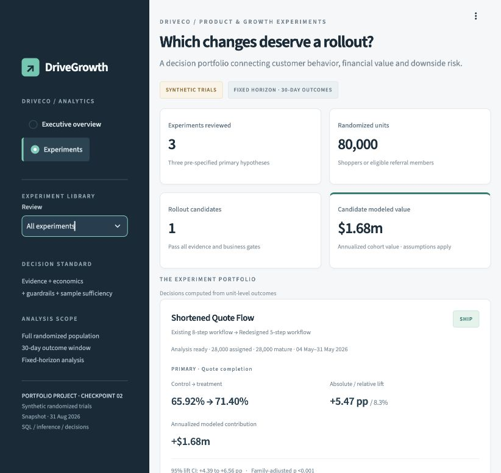
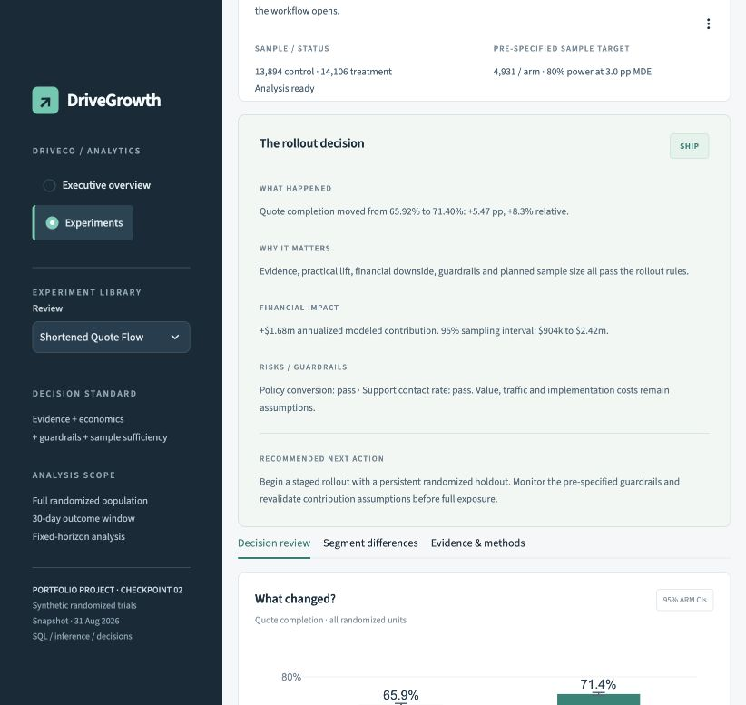

# DriveGrowth

**Growth Experimentation & BizOps Analytics Platform for a Digital Auto Insurance Marketplace**

A local analytics product for deciding where growth creates value—and whether a product change deserves a rollout.

> This project uses synthetically generated customer-level data designed to simulate realistic insurance marketplace behavior. It is not affiliated with or based on proprietary data from any insurance company.

DriveCo is a fictional marketplace. The project demonstrates analytical implementation and operating judgment, not results achieved at a real business.

## The decision it can now support

“We shortened the quote flow. Should management ship it, what could it be worth, where is the effect strongest, and what evidence could change the decision?”

The **Experiments** workspace answers that question with randomized comparisons, financial decomposition, guardrail checks, sample planning, segment interactions and an explicit decision policy. It also surfaces the opposite case: an incentive can improve conversion and still fail the economic hurdle.

See the [generated experiment decision review](docs/experiment_review.md) for current results, intervals and recommendations. Every number comes from the experiment ledger. The [downloadable decision records](docs/experiment_results.json) include the design, evidence, model assumptions and data fingerprints.





## Working product

- **Executive overview:** nine KPIs, prior-period comparisons, pre-acquisition contribution, acquisition economics, funnel health, computed observations and working portfolio filters.
- **Experiment portfolio:** Shortened Quote Flow, Referral Incentive and Carrier Ranking Algorithm; 80,000 synthetic randomized units, complete 30-day outcomes and distinct business tradeoffs.
- **Experiment detail:** primary and secondary effects, confidence intervals, adjusted p-values, sample sufficiency, noninferiority guardrails and a prominent SHIP / CONTINUE TESTING / DO NOT SHIP decision.
- **Rollout economics:** incremental policies, value-mix changes, incentive costs on all conversions, recurring implementation costs and one-time setup costs. Interactive assumptions recalculate a separate scenario decision.
- **Segment evidence:** channel, device, state and risk treatment effects, with interaction tests and multiplicity correction rather than comparisons of subgroup significance.
- **Auditability:** DuckDB assignment ledger, executable SQL, source fingerprints, missing-outcome checks, reproducible unit bootstrap, JSON exports and generated executive memos.

The historical book contains 500,000 customers, 1,438,755 funnel events and 104,602 policies. Trial populations are separate from that historical acquisition book. No trial results are retroactively inserted into historical revenue.

## SQL and analytical depth

The **11 numbered SQL analyses** demonstrate CTEs, joins, window functions, ranking, rolling acquisition, censor-aware retention, channel economics and intention-to-treat experiment denominators. Start with:

- [Funnel analysis](sql/01_funnel_analysis.sql)
- [Cohort retention](sql/03_cohort_retention.sql)
- [Rolling acquisition](sql/08_rolling_acquisition.sql)
- [Experiment analysis and financial reconciliation](sql/11_experiment_analysis.sql)

Primary conversion inference uses two-proportion tests and Newcombe intervals, with Fisher's exact test for sparse cells. Three primary hypotheses receive Bonferroni correction. Continuous metrics use Welch tests; skewed unit financial values use 3,000 bootstrap draws. Guardrail safety must be demonstrated within a pre-specified tolerance. Statistical significance alone cannot produce SHIP.

Read the [experiment methodology and decision contract](docs/experimentation.md), [metric dictionary](docs/data_dictionary.md), and [historical simulation assumptions](docs/methodology.md).

## Run locally

Python 3.11+; tested with Python 3.13. From this directory:

```bash
python3 -m venv .venv
source .venv/bin/activate
pip install -r requirements.txt
python -m src.generate_data
python -m src.generate_experiments
python -m src.database
python -m src.validate_data
python -m src.experiment_report
python -m src.checkpoint_report
pytest -q
streamlit run app.py
```

Windows activation: `.venv\Scripts\activate`. Once data exists, only `streamlit run app.py` is needed.

Open the sidebar's **Experiments** workspace, then choose a trial. Use **Decision review**, **Segment differences**, and **Evidence & methods** to move from result to recommendation. The economics panel includes rollout sensitivity controls. The evidence tab exports an auditable decision record.

Regenerate experiment inputs after changing the historical data; the database build rejects stale source fingerprints. Generated data files and the local database are excluded from version control. No cloud account, credentials, paid API, Docker or external database is required.

## Architecture

```text
Seeded historical source + registered synthetic trials
                        ↓
             Parquet → local DuckDB
                        ↓
     SQL marts / randomized-unit analytical layer
                        ↓
   Executive overview + experiment decision workspace
                        ↓
      CSV / auditable JSON / generated decision memos
```

Primary stack: Python, SQL, DuckDB, NumPy, pandas, Parquet, SciPy, statsmodels, Plotly and Streamlit.

```text
drivegrowth/
  app.py                         # Shared shell and real page routing
  views/
    overview.py                  # Preserved executive overview
    experiments.py               # Portfolio, detail, scenarios and evidence
  src/
    generate_data.py             # Correlated historical simulation
    generate_experiments.py      # Pre-exposure randomized trial generation
    experiment_designs.py        # Designs, guardrails and sample assumptions
    experimentation.py          # Inference, impact and decision primitives
    experiment_analysis.py      # Database-backed estimates and audit records
    experiment_charts.py
    experiment_report.py        # Generated decision memo and JSON
    database.py / analytics.py / metrics.py
    executive_insights.py / validate_data.py / ui.py
  sql/                           # 11 analyses + operating and trial marts
  tests/                         # Metrics, experiment logic, pipelines, app
  assets/ / .streamlit/           # Shared visual system
  data/raw/ / data/processed/     # Generated local artifacts
  docs/                          # Methods, decisions, dictionary, screenshots
```

See [architecture details](docs/architecture.md).

## What the tests cover

Conversion lift, zero/sparse denominators, confidence intervals, p-values, unequal variance, bootstrap reproducibility, incentive accounting, financial sensitivity, decision gates, guardrail noninferiority, heterogeneous effects, source-data reproducibility, SQL reconciliation, sample-ratio mismatch, immature outcomes, navigation, scenario controls and existing overview behavior.

The latest checkpoint passes **58 automated tests** plus **22 historical data checks** and **21 experiment quality checks**. Run the commands above to reproduce validation.

## Limits and next work

All data and trial effects are synthetic. Modeled policy value is not experimentally observed long-term retention. Annualized impact values twelve monthly acquisition cohorts over twelve policy months each; it is **not realized revenue or first-year recognized contribution**. Its interval covers sampling, not uncertainty in traffic, retention or implementation costs. Referral tests assume one opportunity per member with no network spillovers. Segment findings are exploratory.

The historical revenue chart aggregates a growing active book and remains smoother than the experiment enrollment and cumulative-result charts. The operating snapshot has not been cosmetically altered to manufacture volatility.

**Checkpoint 02 stops at Experiments.** The marketing/growth optimizer has not been started. The proposed next sequence, after review, is Growth Optimizer → Carrier Strategy → Executive Decisions → further SQL/README polish. Forecasting and additional segmentation are deferred.
